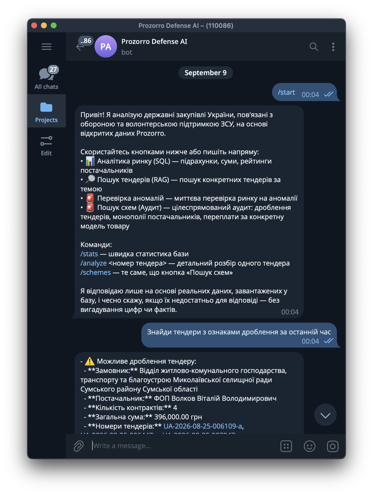
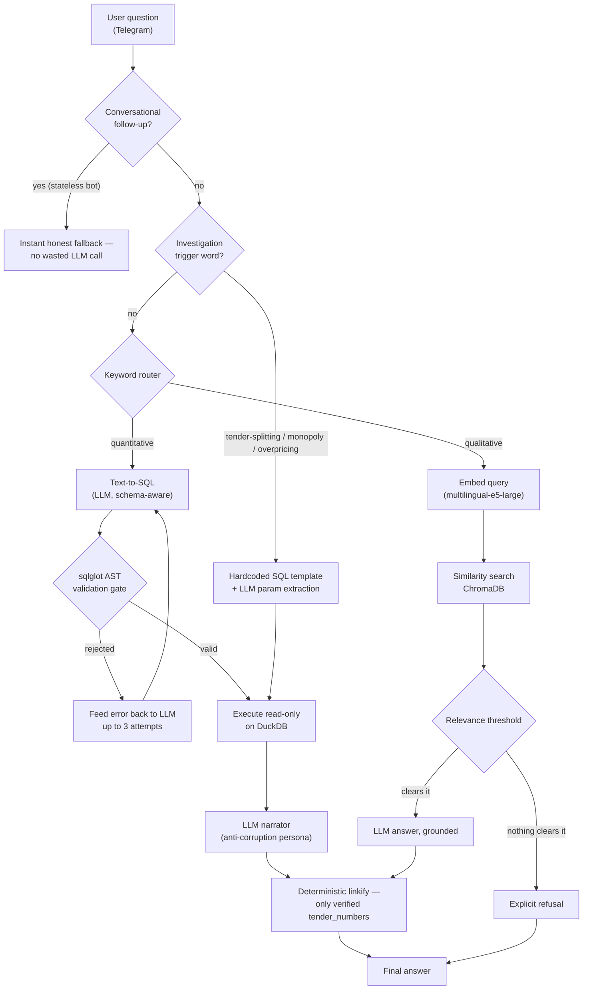

# Prozorro Defense AI Explorer

<p align="center">
  <em>A hybrid RAG assistant that turns natural-language questions into validated SQL, semantic search, and structured corruption-detection heuristics over 9,000+ real Ukrainian public procurement records — deployed as a production Telegram bot.</em>
</p>

<p align="center">
  
  
  
  
  
  
  
  
</p>

## 🚀 Try it Live

**[@Prozorro_Defense_AI_bot](https://t.me/Prozorro_Defense_AI_bot)** — open Telegram and ask it something, in Ukrainian or English:

> *"скільки тендерів на генератори було створено у 2024 році?"*
> *"чи є ознаки дроблення тендерів у базі?"*
> *"дрони для розвідки"*

Deployed 24/7 on a production Linux server via Docker, backed by a live, continuously-updated dataset of Ukrainian defense procurement records.

## Elevator Pitch

An anti-corruption investigative assistant for Ukrainian defense procurement data: it decides for itself whether a question needs a database lookup, a semantic search, or a targeted fraud-detection query, then answers grounded in real evidence — with every claim traceable back to a verifiable source record, and every unsafe or ungrounded answer refused rather than guessed.

## Key Features

- **Hybrid Retrieval-Augmented Generation (RAG)** — a keyword-driven router dispatches each query to one of three engines: text-to-SQL analytics, vector similarity search (`ChromaDB` + multilingual sentence embeddings), or hardcoded investigative SQL templates — rather than relying on a single brittle approach for every question type.
- **AST-validated text-to-SQL pipeline** — LLM-generated SQL is never executed directly. Every query is parsed and validated at the **abstract syntax tree level** via `sqlglot` (single `SELECT`/`UNION` only, table whitelisting, no file-access functions) before it ever reaches the database, with an automatic self-correction retry loop on validation failure.
- **Zero-injection-surface parameter binding** — the three built-in corruption-detection templates (tender-splitting, supplier-monopoly, and overpricing analysis) never string-interpolate LLM output into SQL; every extracted parameter is bound as a real query parameter.
- **Deterministic evidence linking** — the LLM never generates links itself. Every tender ID cited in a response is cross-checked in code against what was actually retrieved before being turned into a clickable source link, eliminating hallucinated references by construction.
- **Incremental ETL pipeline** — a resumable, idempotent data pipeline (extract → transform → load) that syncs only new or modified records since the last run, instead of re-processing the full dataset on every update.
- **Provider-agnostic LLM abstraction** — a single internal interface (`llm_client.py`) switches between a locally-hosted open-weight model (Ollama) and a hosted API (OpenAI) via one environment variable, with zero changes to calling code.
- **Self-healing job scheduler** — nightly data refreshes run via `APScheduler`, with a startup staleness check that automatically triggers a catch-up sync if a scheduled run was silently missed (e.g., after a host restart) — a real production failure mode identified and fixed through live testing.
- **Containerized, production-deployed** — packaged with `Docker` and `docker-compose`, pinned dependency versions for reproducible builds, and currently running unattended on a cloud VPS.

## Tech Stack

| Category | Technologies |
|---|---|
| **Language** | Python 3.13 |
| **Database & Analytics** | DuckDB (SQL analytics engine), Pandas (ETL transformation) |
| **Vector Store / Embeddings** | ChromaDB, `sentence-transformers` (`intfloat/multilingual-e5-large`) |
| **LLM Providers** | OpenAI API (`gpt-4o-mini`), Ollama (local open-weight models) |
| **SQL Safety** | `sqlglot` — AST-level query parsing and validation |
| **Bot Framework** | `aiogram` v3 (async Telegram Bot API) |
| **Scheduling** | APScheduler (`AsyncIOScheduler`) |
| **Deployment** | Docker, Docker Compose, Linux VPS |
| **Data Source** | Prozorro Open Contracting API (Ukraine's public procurement registry) |

## Screenshots

<!-- Insert screenshots below — e.g. the bot answering a Ukrainian-language question, an investigation-template result with evidence links, and the /schemes or /stats command output. -->




## Architecture



**The router** is a curated keyword list rather than a trained classifier — a deliberate, documented tradeoff favoring predictability and debuggability over generality.

**The SQL path** never trusts model output directly: every generated query passes through an AST-level validation gate (`sqlglot`) before touching the database, with a bounded self-correction loop on rejection.

**Every cited tender number is a verified, clickable link** — never one the LLM produced unchecked. The model cites plain identifiers; application code cross-references each one against what was actually retrieved before rendering a link, so a garbled or invented ID stays inert plain text.

## Quick Start / Deployment

The application is fully containerized and designed to run unattended in production.

```bash
git clone https://github.com/Yehor2007/prozorro-defense-ai.git
cd prozorro-defense-ai
cp .env.example .env
# edit .env — set TELEGRAM_BOT_TOKEN (from @BotFather) and either:
#   LLM_PROVIDER=openai + OPENAI_API_KEY=sk-...      (no GPU required)
# or
#   LLM_PROVIDER=ollama                              (requires a local/remote Ollama host)

# build the dataset once (extract -> transform -> load)
python extract_prozorro.py
python transform_prozorro.py
python load_chroma.py

# launch
docker compose up -d --build
docker compose logs -f bot
```

Nightly incremental data syncs and startup staleness recovery run automatically once the container is live — no manual intervention required post-deployment. See `DEPLOY.md` for GPU/remote-Ollama variants and additional operational detail, and `CONTEXT.md` for the full engineering log of every issue found and fixed through live testing on the deployed system.

## Project Documentation

- **`CONTEXT.md`** — a chronological engineering log documenting every bug found, its root cause, the fix applied, and how it was verified against the live system — including production issues (an unpinned-dependency version conflict, a silently-missed scheduler run) that were caught only through actual deployment, not code review alone.
- **`DEPLOY.md`** — deployment reference covering Docker Compose configuration, GPU/remote-LLM setup, and scheduling.
