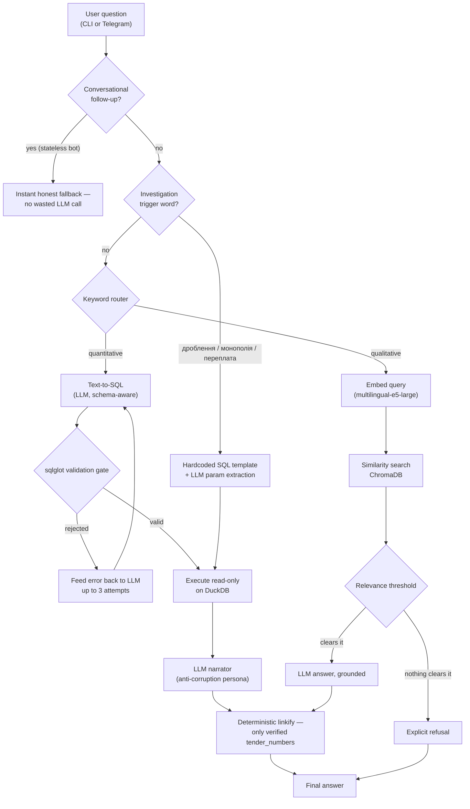

# Prozorro Defense AI Explorer

A hybrid RAG assistant — and anti-corruption investigator — for exploring Ukrainian defense and volunteer-related public procurement data from [Prozorro](https://prozorro.gov.ua/) in natural language, via CLI or Telegram.

Ask it a question in Ukrainian (or English) and it decides for itself whether that's a lookup ("show me drone tenders"), a number ("what's the total spent on generators?"), or a targeted corruption check ("is this buyer splitting tenders to dodge open bidding?") — and answers accordingly, grounded in real tender data, with clickable links back to the source tenders and an explicit refusal when the data doesn't support an answer.

## Why this exists

Public procurement data is exactly the kind of dataset where "the LLM sounds confident" is not good enough — a wrong number or a fabricated supplier name in this domain isn't a curiosity, it's a credibility failure. This project is built around that constraint: every layer assumes the model *will* occasionally do something wrong (hallucinate a name, generate unsafe SQL, guess a fact, skip citing its evidence) and adds a deterministic check that doesn't depend on the model behaving — rather than trying to prompt-engineer perfect compliance and hoping for the best. `CONTEXT.md` is the full, honest log of every one of those failures found through actual live testing, not just written and assumed to work.

## What it can do

- **Free-text search** over tender chunks (vector/RAG) — "дрони для розвідки" — with clickable links to the real Prozorro pages, only ever generated for tender numbers the system actually retrieved.
- **Natural-language analytics** (text-to-SQL, validated, never shown raw to the end user) — "скільки тендерів на генератори створено у 2024 році?"
- **Three hardcoded corruption-investigation templates** — not free-form SQL generation, fixed and reviewed queries with an LLM only extracting the one parameter they need:
  - **Tender splitting** — repeated just-under-the-competitive-bidding-threshold contracts to the same supplier
  - **Local monopoly / favoritism** — a buyer's most-favored suppliers by win count and total value
  - **Apples-to-apples overpricing** — one exact item's priciest instance vs. the median for that *same* item, not a broad category average
- **Discriminatory-spec detection** — flags tender requirements that look tailored to a single manufacturer (missing the legally-required "or equivalent" language)
- **Telegram UI**: persistent keyboard shortcuts, an inline `/schemes` menu for the investigation templates, `/stats`, `/analyze <tender_id>`, instant "⏳ working..." feedback so a 10-30s local-LLM answer doesn't feel stalled.

## Architecture



**The router** is a curated keyword list, not a classifier — deliberately simple and documented as a heuristic. Conversational follow-ups ("Why?", "the same one?") are caught *before* routing and get an honest "I don't have memory of our conversation" reply instead of a doomed-to-fail query.

**The SQL path** never trusts the model's SQL directly. Free-form queries pass through a validation gate built on [`sqlglot`](https://github.com/tobymao/sqlglot) (single `SELECT`/`UNION` only, whitelisted tables, no file-reading functions, `LIKE` deterministically rewritten to `ILIKE`) before ever reaching DuckDB, with up to 3 self-correction attempts on failure. The three investigation templates skip this entirely by construction — their SQL is fixed Python, and the only LLM-supplied input (a buyer name, an item model) is bound as a real parameter, never string-interpolated, so it has zero injection surface regardless of what the model extracts.

**Every tender number in an answer is a real, clickable link** — but never one the LLM wrote itself. The model cites plain tender numbers; code cross-checks each one against what was actually retrieved/computed and only then turns it into a link, so a garbled or invented ID stays inert plain text instead of becoming a broken or misleading link.

**The anti-corruption persona** proactively compares prices against a like-for-like average (not a broad category blend), flags repeat suppliers, and marks genuine findings with `⚠️ Можлива аномалія / Ризик переплати` — while a deterministic backstop double-checks the comparison group wasn't too small to be meaningful, and correctly recognizes Prozorro's own "Оборонний постачальник" masking convention as redacted data, not a real monopoly.

## Tech stack

| Layer | Technology |
|---|---|
| Data source | [Prozorro Open Contracting API](https://prozorro.gov.ua/) (`requests`), incremental sync via `update_data.py` |
| Transformation | `pandas` → flattened `tenders` / `items` tables in `duckdb` |
| Vector store | `chromadb`, embedded with `sentence-transformers` (`intfloat/multilingual-e5-large`) |
| SQL safety | `sqlglot` — AST-level validation, not string matching |
| LLM inference | `LLM_PROVIDER=ollama` (local, free, `qwen2.5:14b-instruct`) or `openai` (`gpt-4o-mini`) — one env var, see `llm_client.py` |
| Interfaces | CLI (`rag_query.py`) and Telegram (`telegram_bot.py`, `aiogram` v3, async) |
| Scheduling | `APScheduler` inside the bot process (nightly incremental sync) with a startup staleness catch-up |
| Deployment | `Dockerfile` + `docker-compose.yml` — see `DEPLOY.md` |

## Repository layout

```
extract_prozorro.py     Historical backfill — pulls tender JSON from the Prozorro API (CPV + keyword filtered)
update_data.py           Nightly-safe incremental sync — new/updated tenders only, no re-fetch of everything
transform_prozorro.py   Flattens raw JSON into DuckDB tables (tenders, items)
load_chroma.py          Chunks + embeds tenders into a persistent ChromaDB collection
llm_client.py           Provider-agnostic LLM access (ollama or openai) — every call site goes through here
investigations.py       The 3 hardcoded corruption-investigation SQL templates
rag_query.py            Hybrid router, text-to-SQL + validation gate, vector RAG, CLI entry point
telegram_bot.py         Telegram interface — buttons, /schemes, /stats, /analyze, scheduler
Dockerfile / docker-compose.yml   Production deployment (see DEPLOY.md)
requirements.txt        Pinned to exact locally-verified versions (see CONTEXT.md for why that pin matters)
.env.example             Copy to .env — never commit .env
```

`data/` (raw JSON + `prozorro.duckdb`) and `chroma_db/` (the vector store) are regenerated by the pipeline below — not tracked in git.

## Setup

### Option A — Docker (recommended for just trying it)

```bash
cp .env.example .env
# edit .env: set TELEGRAM_BOT_TOKEN (from @BotFather), and either
#   LLM_PROVIDER=openai + OPENAI_API_KEY=sk-...   (no GPU needed)
# or
#   LLM_PROVIDER=ollama + `ollama serve` running with a model pulled
```

Build the dataset once (see step 3 below — Docker doesn't do this for you), then:

```bash
docker compose up -d
docker compose logs -f bot   # watch it come up
```

See `DEPLOY.md` for GPU/remote-Ollama variants and details.

### Option B — local Python

**1. Prerequisites:** Python 3.11+, and either Ollama (`ollama pull qwen2.5:14b-instruct`) or an OpenAI API key.

**2. Install:**
```bash
python3 -m venv venv
source venv/bin/activate
pip install -r requirements.txt
```

**3. Build the dataset (once):**
```bash
python extract_prozorro.py       # pulls tenders from Prozorro into data/raw/
python transform_prozorro.py     # flattens into data/prozorro.duckdb
python load_chroma.py            # embeds + loads into chroma_db/
```
Filtered for defense- and volunteer-adjacent procurement (CPV prefixes for security/military equipment, tactical clothing, drones, medical supplies — see `TARGET_CPV_PREFIXES` / `KEYWORDS` in `extract_prozorro.py`). After the first backfill, run `python update_data.py` any time to pull just what's changed since — this is also what runs automatically every night once the bot is up.

**4. Query it — CLI:**
```bash
python rag_query.py --query "скільки тендерів на генератори було створено у 2024 році?"
python rag_query.py   # interactive mode
```

**5. Or run the Telegram bot:**
```bash
cp .env.example .env   # set TELEGRAM_BOT_TOKEN + your LLM_PROVIDER
python telegram_bot.py
```

## Example queries

| Question | Routed to | What happens |
|---|---|---|
| "дрони для розвідки" | Vector | Retrieves and cites real drone tenders with clickable links, or explicitly refuses if the category isn't loaded |
| "скільки тендерів створено у 2024 році?" | SQL | Generates, validates, and executes a `COUNT(*)` |
| "хто з постачальників найчастіше виграє тендери на медичне обладнання?" | SQL | Excludes null/masked-supplier rows, flags concentration with named evidence if it's real |
| "чи є ознаки дроблення тендерів у базі?" | Investigation template | Finds real 90-99k UAH contract clusters to the same supplier, with links |
| "чи є переплата за Mavic 3T?" | Investigation template | Compares the priciest instance to the median for that exact model — not the whole drone category |
| "які технічні вимоги ставлять до FPV-дронів?" | Vector | Answers from available chunk text; discloses that full specs live in Prozorro's PDFs, which aren't indexed here |
| "Why?" / "А це за всі дрони?" | Stateless-followup fallback | Honest "I don't remember our conversation" instead of a broken query |

## Debugging

Generated SQL is intentionally never shown to end users, but every attempt is printed to the terminal as `[SQL DEBUG] ...` / `[INVESTIGATION SQL DEBUG] ...`, including validation-gate rejections and execution errors. If an answer looks wrong, re-run the same query from a terminal and read that line.

## Known limitations

- **The router and investigation triggers are keyword heuristics, not classifiers.** Tuned against real failures found in testing (see `CONTEXT.md`), but will still misroute some phrasings.
- **The anomaly flag is pattern-matching, not statistics.** Treat every `⚠️` as a lead to verify against the linked tenders, not a verified conclusion.
- **The bot has no conversation memory.** Follow-up questions get an honest fallback, not a (broken) attempt at an answer.
- **The vector index only holds short tender-summary chunks**, not full technical specifications (those live in PDF attachments on Prozorro's own site, not parsed here).
- **No automated test suite yet.** Everything here was verified through repeated live testing against real LLM calls and a real Docker deployment — see `CONTEXT.md` for the specific verification each fix went through, including two production bugs (an unpinned-dependency container crash, and a scheduler silently missing a nightly run) found only by actually running the deployed system, not by writing it.

## Project history

`CONTEXT.md` is the running engineering log for this project — every bug found, its root cause, the fix, and how it was verified, in chronological order. It's the most detailed record of what's actually been tested and why specific design choices were made — including several cases where a fix that looked complete on paper broke, or was silently incomplete, until tested against the real system.
